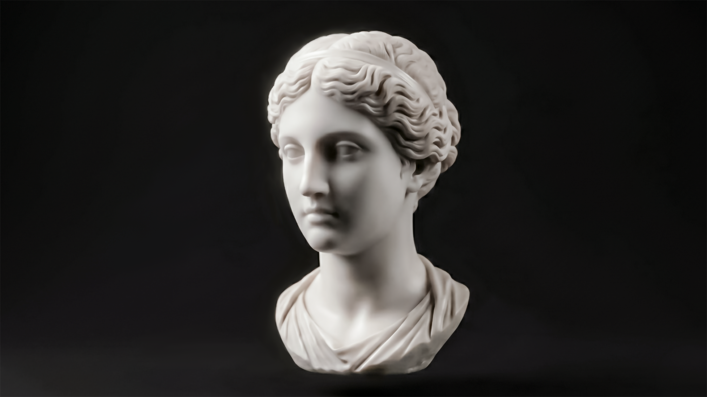

# Eternal

An interactive web artwork: a classical marble bust that **physically fractures into stone shards and digital dust** under your cursor, then slowly restores — a sculpture dissolving into memory.

**▶ Live demo:** https://rzenergy-hash.github.io/eternal-art/



## Interaction

- **Move across the marble** to break it. The contacted surface cracks, sheds irregular stone shards that tumble and fly outward, then crumble into fine dust, leaving an empty void that heals over time.
- **Move slowly** for gentle, powdery erosion; **flick fast** for violent explosions — mouse speed controls the break force, and fragments inherit the mouse's direction.
- Works with **mouse and touch**.

## How it works

- The bust is a grid of **breakable cells**, each with its own restoration timer, kept separate from the original image via an erosion mask.
- Breaking a cell spawns a three-stage cascade: **large shards → small fragments → dust**.
- Fragments are **procedurally generated irregular polygons** (shards, splinters, triangles, kites, concave pieces) clipped from the real image texture — no two break events look alike.
- Full physics: inherited velocity, drag, turbulence, rotation, angular velocity, opacity fade, gravity-free drift.

A small control panel (✦, top-right) tunes cursor radius, density, spread, restoration speed, opacity, and particle size.

## Run locally

A local server is required (browsers block reading image pixels from `file://`):

```bash
python3 -m http.server 5050
# then open http://localhost:5050
```

## Files

- `index.html` — markup + control panel
- `style.css` — styling
- `script.js` — the fracture/particle engine
- `eternalv3.png` — the base image

## Credits

Built with vanilla HTML / CSS / Canvas 2D.
